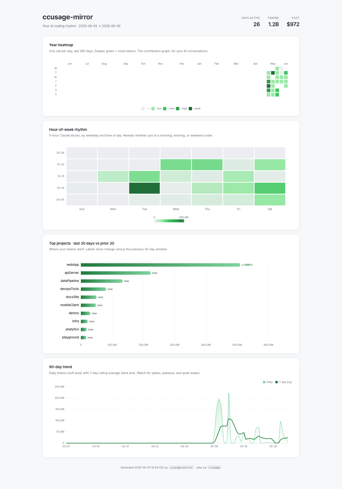

# ccprism

> Look in the mirror at your relationship with AI.

A personal CLI that generates a self-contained HTML report visualizing your AI coding agent usage patterns over time. Stands on [ccusage](https://github.com/ryoppippi/ccusage); does not replace it.



## Why this exists

| Tool | Slot | Form factor |
| --- | --- | --- |
| [CodexBar](https://codexbar.app) | Tactical "right now" | macOS menu bar |
| [ccusage](https://github.com/ryoppippi/ccusage) | Accurate numeric report | Terminal table |
| **ccprism** | **Reflective patterns** | **HTML dashboard** |

GitHub's contribution graph isn't a more accurate `git log` — it shows you a different thing. `ccprism` is the same idea for your AI usage: a reflective visual you open weekly, not a meter you check minute-to-minute.

## What you get

Four charts in one self-contained HTML file:

1. **Year heatmap** — 365 day cells, GitHub-green intensity by daily tokens.
2. **Hour-of-week rhythm** — 5h × weekday heatmap built from Claude billing blocks. Shows whether you're a morning/evening/weekend coder.
3. **Top projects** — last-30-days horizontal bar with month-over-month delta labels.
4. **90-day trend** — daily bars + 7-day rolling average line.

Plus a small header strip: days active · total tokens · total cost.

## Install

Requires [Bun](https://bun.com) ≥ 1.1. ccusage is invoked on demand via `bunx`; no global install required (but installing globally is faster — see below).

```bash
git clone https://github.com/huaruic/ccprism.git
cd ccprism
bun install
bun link            # exposes `ccprism` on $PATH
```

## Use

```bash
ccprism                                  # generate + open in browser
ccprism --no-open                        # generate only
ccprism --out ~/Desktop/ccprism.html     # custom output path
ccprism --since 2026-01-01               # override trend window start
ccprism --from test/fixtures             # render from sanitized demo data
```

The first run downloads `ccusage` via `bunx` (~5 s). To skip that on every run, install ccusage globally:

```bash
bun install -g ccusage
```

## Architecture

```
local Claude logs                    bunx ccusage --json
       │                                     │
       ▼                                     │
ccusage (Rust, your filesystem) ─────────────┘
       │
       ▼ (4 subprocess calls)
ccprism (this tool)
       │   - transforms JSON → chart-ready data (server)
       │   - builds ECharts options (inline JS in HTML)
       ▼
report.html (1 MB, self-contained, ECharts inlined)
       │
       ▼
your browser
```

This tool **does not parse Claude logs directly** — ccusage already does that better than we ever would. We shell out, transform the JSON, and render.

## Tech choices

| Decision | Pick | Why |
| --- | --- | --- |
| Runtime | Bun + TypeScript | Native TS, fast subprocess, single-binary build path |
| Charts | [Apache ECharts](https://echarts.apache.org/) | One library for all 4 chart types (calendar, cartesian heatmap, line, bar) |
| CLI | [citty](https://github.com/unjs/citty) | Tiny, ESM, TS-first |
| Browser open | [open](https://github.com/sindresorhus/open) | Cross-platform, battle-tested |

## Develop

```bash
bun install
bun test                  # run unit tests
bun run typecheck         # tsc --noEmit
bun run start             # equivalent to `ccprism`
bun run fixture           # refresh test fixtures from your local ccusage
```

Test fixtures live in `test/fixtures/*.json` — sanitized snapshots (synthetic project names, fake session UUIDs, real numeric shape). Real local data goes to `test/fixtures-real/` and stays out of the repo.

`bun run fixture` does the full refresh: captures from your local ccusage into `test/fixtures-real/`, then runs `scripts/sanitize-fixtures.ts` to overwrite `test/fixtures/`.

See [`SPEC.md`](./SPEC.md) for the product spec, feature acceptance criteria, and out-of-scope items.

## Scope (and what it's not)

**In scope (MVP)**: the four charts above, Claude Code usage only.

**Not in scope** (parked in SPEC.md):

- True hourly resolution (current 5h granularity comes from ccusage `blocks`)
- Coverage of other agents (Codex, Gemini, Bailian, etc.) — wait for ccusage to expose them in the same shape
- Real-time monitoring (that's [CodexBar's](https://codexbar.app) job)
- Cost projection or budget alerts
- Hosted/shared reports (this is local-only by design)

## License

MIT. Stand on giants — credit them.
